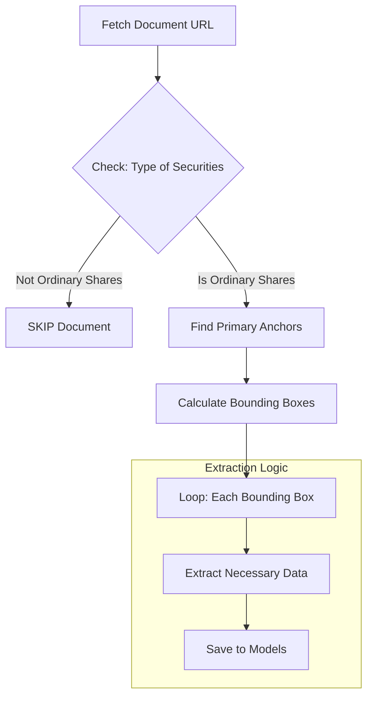
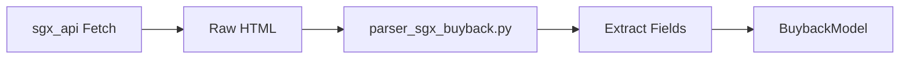

## 📂 Project Structure

The project follows a modular pipeline architecture. 

### Core Components

* **`main_cli.py`**: The application entry point. Orchestrates the flow between fetching (via `sgx_api`) and processing (via `fetch_*` modules).
* **`sgx_api/`**: The Network Layer. Handles raw API requests.
* **`alerting/`**: The Notification Engine. 

### Domain Logic (Parsers)

* **`fetch_sgx_buyback/`**:
    * `parser_sgx_buyback.py`: Logic to extract share buyback transaction data.
    * `utils/`: Contains specialized helpers for parsing PDF payloads buyback.
    * `models.py`: Data validation schemas for buybacks.
* **`fetch_sgx_filings/`**:
    * `parser_sgx_filings.py`: Logic to extract company announcements.
    * `utils/`: Contains specialized helpers for parsing PDF payloads, html parser and converter currency. 
    * `models.py`: Data validation schemas for filings.

### Shared Resources

* **`sgx_scraper/config/settings.py`**: Centralized configuration (ENV variables, credentials).
* **`sgx_scraper/utils/`**: Project-wide utilities used by multiple modules (e.g., CLI helpers, common date formatting).
    * *Note: Module-specific utilities are kept inside their respective directories (e.g., `fetch_sgx_filings/utils`).*


## 🧠 High Level Core Logic & Data Flow

### 1. SGX Filings Pipeline (`fetch_sgx_filings`)

This module handles the high variability of SGX announcement forms (e.g., Form 1, Form 3, Form 6). The parser is designed to handle three distinct document structures:

1.  **Single Transaction:** One shareholder, one transaction (e.g., [Form 1 Example](https://links.sgx.com/FileOpen/_FORM1_LWS_2025.10.03.ashx?App=Announcement&FileID=860899)).
2.  **Multi-Shareholder (Distinct):** Multiple shareholders, each with unique transaction details (e.g., [Form 6 Example](https://links.sgx.com/FileOpen/_FORM6-REIT_Manager.ashx?App=Announcement&FileID=863792)).
3.  **Multi-Shareholder (Shared):** Multiple shareholders sharing one transaction detail section (e.g., [Form 3 Example](https://links.sgx.com/FileOpen/_Substantial%20Unitholders-Form%203.ashx?App=Announcement&FileID=864724)).

#### The Parsing Algorithm (Anchor-based Segmentation)

To handle this complexity, we do not parse the document linearly. Instead, we use a **Bounding Box (BBox)** strategy driven by text anchors.

**Step 1: Pre-Validation (The "Ordinary Share" Check)**
Before extracting data, the parser checks the "Type of Securities" checkbox section.
* **Condition:** The document MUST contain a checkmark for `Ordinary voting shares`.
* **Action:** If this option is not selected, the document is considered irrelevant to our tracking scope and is **skipped**.

**Step 2: Anchor Detection**
We scan the document for specific text patterns that signal the start of a new data section. The primary anchors are:
* `"Quantum of interests in securities held by Trustee-Manager"`
* `"Name of Substantial Shareholder/Unitholder:"`
* `"Part II - Substantial Shareholder/Unitholder and Transaction(s) Details"`
* `"Name of Director/CEO:"`

**Step 3: Bounding Box Generation & Extraction**
Using the anchors detected in Step 2, we split the document into Bounding Boxes.
* **Logic:** Text between `Anchor A` and `Anchor B` is isolated as a unique "block."
* **Loop:** We iterate through these blocks. Each block corresponds to one Shareholder/Director entity. This allows the scraper to accurately extract multiple entities from a single PDF.



### 2. SGX Buyback Pipeline (`fetch_sgx_buyback`)

The buyback pipeline logic is linear and strictly structure-dependent, as the data format is consistent across daily reports.

**The Process**

1.  **Retrieve:**
    The `sgx_api` module fetches the specific daily buyback summary URL.

2.  **Parse:**
    The raw HTML content is passed to `parser_sgx_buyback.py`.

3.  **Extract:**
    Data is mapped directly to the `BuybackModel` fields using standard HTML scraping techniques.



## ⚙️ Configuration

The application requires environment variables for database connections, cloud services, and notifications. Create a `.env` file in the root directory:

```env
# Network / Proxy (Optional)
PROXY=

# Database (Supabase)
SUPABASE_URL=
SUPABASE_KEY=

# Cloud Storage (AWS)
AWS_ACCESS_KEY_ID=
AWS_SECRET_ACCESS_KEY=
AWS_REGION=

# Alerting / Notifications
SENDER_EMAIL=
TO_EMAIL=
```

## 🚀 Usage

This project utilizes Typer for CLI interaction and uv for dependency management and execution.

### Available Commands

| Command | Description |
| :--- | :--- |
| `scraper_buybacks` | Extracts daily share buyback transactions. |
| `scraper_filings` | Extracts company announcements using anchor detection. |

### Shared Options
Both commands accept the following arguments to control the date range and database operations.

| Option | Flag | Type | Default | Description |
| :--- | :--- | :--- | :--- | :--- |
| Start Period | `--period-start` | `TEXT` | `None` | Filter start date (YYYYMMDD). **Defaults to T-2 days** if empty. |
| End Period | `--period-end` | `TEXT` | `None` | Filter end date (YYYYMMDD). **Defaults to Today** if empty. |
| Page Size | `--page-size` | `INT` | `20` | Number of records to fetch per page request. |
| Push to DB | `--is-push-db` | `BOOL` | `True` | Controls database ingestion. Use `--no-is-push-db` to run as a dry-run. |

### Examples

**1. Standard Daily Run (Default)**
Fetches data for the **last 2 days** (Today and Yesterday) and saves it to the database.
```bash
# Run Buybacks
uv run python -m sgx_scraper.main_cli scraper_buybacks

# Run Filings
uv run python -m sgx_scraper.main_cli scraper_filings
```

**2. Historical Dry Run (No Database Save)**  
Fetches data from October 1st to October 5th, 2025 without writing to Supabase.

```bash
uv run python -m sgx_scraper.main_cli scraper_buybacks \
  --period-start 20251001 \
  --period-end 20251005 \
  --no-is-push-db
```

**3. Pagination Control**  
Fetch data with a larger batch size per request.

```bash
uv run python -m sgx_scraper.main_cli scraper_buybacks --page-size 50
```

### General Help

To view all available commands and auto-generated help documentation:

```bash
uv run python -m sgx_scraper.main_cli --help
```
